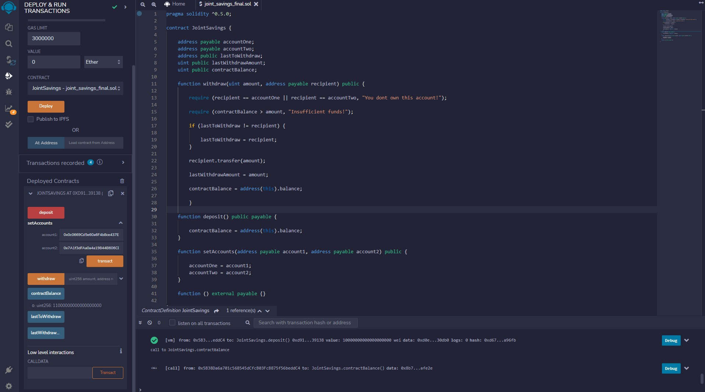

# Challenge_20_Ethereum_Smart_Contract_Creation_&_Deployment
The objective of this challenge is to create a Solidity smart contract that accepts 2 addresses; These addresses will be able to control a joint savings account on the Ethereum Blockchain. The contract will have the functionality to deposit, withdraw, check the outstanding balance and the security protocols to prevent access to the account without permission.

---

## Technologies
The programming language used for this analysis was **Python (v 3.9.7)**.

The applicable software needed to run this analysis are:

` Ethereum Remix IDE `

---

## Contribution 
James Handral

James.Handral@gmail.com

---
## License

N/A

---

## Challenge Summary 
1. Create a Joint Savings Account Contract in Solidity.
2. Compile and Deploy Your Contract in the Ethereum VM. 
3. Interact with Your Deployed Smart Contract.

---

## Screenshots of interaction with Deployed Smart Contract:

### A- Screenshot of the Deployed Smart Contract on VM:

### B- Screenshot of the setup of the 2 Ethereum addresses in the Deployed Smart Contract:

### C- Screenshot of deposit functionality of Smart Contract:

- 1. **Beginning account balance $0**

- 2. **Deposit of 1 ether as wei - test 1**

- 3. **Deposit of 10 ether as wei - test 2**

- 4. **Deposit of 5 ether as wei - test 3**

### D- Screenshot of withdrawal functionality of Smart Contract:

- 1. **Withdrawal of 5 ether confirmation - test 1**

- 2. **Withdrawal of 10 ether confirmation - test 2**

---

**link to the final joint_saving_final.sol file**

[joint_saving_final](./joint_saving_final.sol)